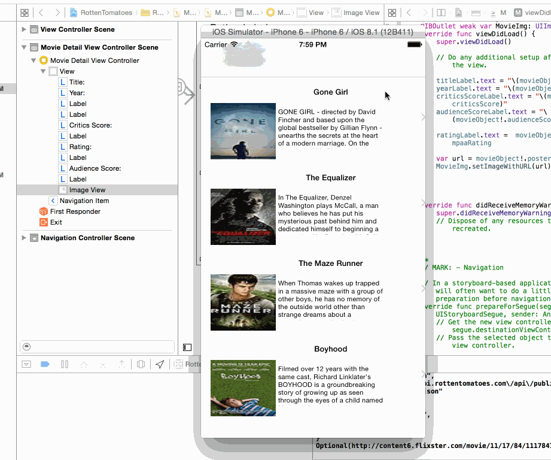

# rottentomatoes
This is the project for homework RottenTomatoes, The basic functionlaty includes load the list of the movies from the
rotten tomatoes API, and show the details of each movies, it uses the swiftjson library to handle the json data

